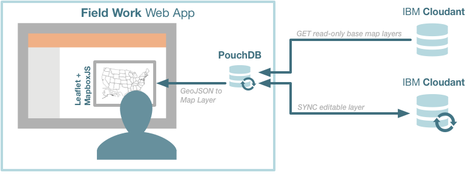

# Field Work

Field Work is a web application that supports offline editing and mapping of geospatial data. It downloads and saves geospatial data locally for offline use using Cloudant Geo or Lucene Geo query, has a UI that supports editing of points, lines and polygons, and syncs locally edited data back to an [IBM Cloudant](https://cloudant.com/) database.

<<<<<<< HEAD
Many field-based industries whose personnel are disconnected from communications networks -- often in remote areas or even underground -- can benefit from this kind of offline-first mobile application.  This demonstration is designed for utilities repair personnel who need to capture events in work orders. 
=======
**NOTE: This project has been forked to be deployed on IBM Bluemix and now lives at [https://github.com/ibm-cds-labs/fieldwork](https://github.com/ibm-cds-labs/fieldwork)**

## Installing
>>>>>>> rajrsingh/master


## Usage

1. This demo has data from the City of Boston. Pan to an area of interest (the initial area you see is fine) and click on the "Load Data" button to start syncing with the Cloudant database. 
1. A "Layers" menu will appear in the top right corner of the map. Click on check boxes next to the data layers to toggle their visibility. 
1. Pushpins will also appear on top of the map. These are the items that can be edited. If you've clicked the "Load Data" button, the "Edit Pins" button will be enabled. Click that to begin editing. 
1. Three new editing tools will appear below the "+" and "-" map controls. Hover over those editing controls for prompts on adding, deleting and modifying  pushpins.

## Architecture



This an architectural overview of the components that make this app run.


## Deploying to IBM Bluemix

The fastest way to deploy this application to Bluemix is to click the **Deploy to Bluemix** button below. If you prefer instead to deploy manually to Bluemix then read the entirety of this section.

[](https://bluemix.net/deploy?repository=https://github.com/ibm-cds-labs/fieldwork.git)

**Don't have a Bluemix account?** If you haven't already, you'll be prompted to [sign up](http://www.ibm.com/cloud-computing/bluemix/) for a Bluemix account when you click the button.  Sign up, verify your email address, then return here and click the the **Deploy to Bluemix** button again. Your new credentials let you deploy to the platform and also to code online with Bluemix and Git. If you have questions about working in Bluemix, find answers in the [Bluemix Docs](https://www.ng.bluemix.net/docs/).

### Optional steps

1. The above procedure will create a random URL for your app on every deployment. This had to be done to avoid everyone deploying the sample app from trying to use the same URL. To fix a static URL for your app, go into the [IBM Bluemix DevOps Services](https://hub.jazz.net/) project created for you in the automatic deployment process above, and:
  1. Click the "Edit Code" button and modify `manifest.yml` 
  2. Change the line `random-route: true` to `host: my-unique-app-name`
  3. On the next deployment, the URL for your app will now be `my-unique-app-name.mybluemix.net`
2. If you plan on modifying the code for this app, and want to use GitHub's code repository ([instead of IBM Bluemix DevOps Services](https://hub.jazz.net/)), follow the instructions below. 

### Manual development

1. Fork the repo
  Click the "**Fork**" button in the top right corner of this repository
  
1. Create a Bluemix Account

     for Bluemix, or use an existing account.

2. Download and install the  tool

3. Clone the app to your local environment from your terminal using the following command

  ```
  git clone https://github.com/ibm-cds-labs/fieldwork
  ```

4. cd into this newly created directory

5. Edit the `manifest.yml` file and change the `<application-host>` to something unique.

  ```
  ---
  declared-services: 
    cloudant-fieldwork-db:
      label: cloudantNoSQLDB
      plan: Shared
  applications:
    - name: fieldwork
      host: fieldwork-gr8one
      memory: 128M
      disk_quota: 512M
      path: .
      domain: mybluemix.net
      instances: 1
      services:
      - cloudant-fieldwork-db
  ```
  The host you use will determinate your application url initially, e.g. `<application-host>.mybluemix.net`.

1. Connect to Bluemix in the command line tool and follow the prompts to log in.

  ```
  $ cf api https://api.ng.bluemix.net
  $ cf login
  ```

1. Create the Cloudant service in Bluemix.
  ```
  $ cf create-service cloudantNoSQLDB Shared cloudant-fieldwork-db
  ```
  
### Manual deployment

To deploy to Bluemix, simply:

  ```
  $ cf push
  ```

## Privacy notice
The 'Field Work' sample web application includes code to track deployments to Bluemix and other Cloud Foundry platforms. The following information is sent to a [Deployment Tracker](https://github.com/cloudant-labs/deployment-tracker) service on each deployment:

* Application Name (application_name)
* Space ID (space_id)
* Application Version (application_version)
* Application URIs (application_uris)

This data is collected from the VCAP_APPLICATION environment variable in IBM Bluemix and other Cloud Foundry platforms. This data is used by IBM to track metrics around deployments of sample applications to IBM Bluemix. Only deployments of sample applications that include code to ping the Deployment Tracker service will be tracked.

## Disabling Deployment Tracking

Deployment tracking can be disabled by removing `./admin.js track && ` from the `install` line of the `scripts` sections within `package.json`.

## License

Licensed under the [Apache License, Version 2.0](LICENSE.txt).


Field Work is a sample application created for the purpose of demonstrating an offline geographic data sync and editing application. The program is provided as-is with no warranties of any kind, express or implied. 
